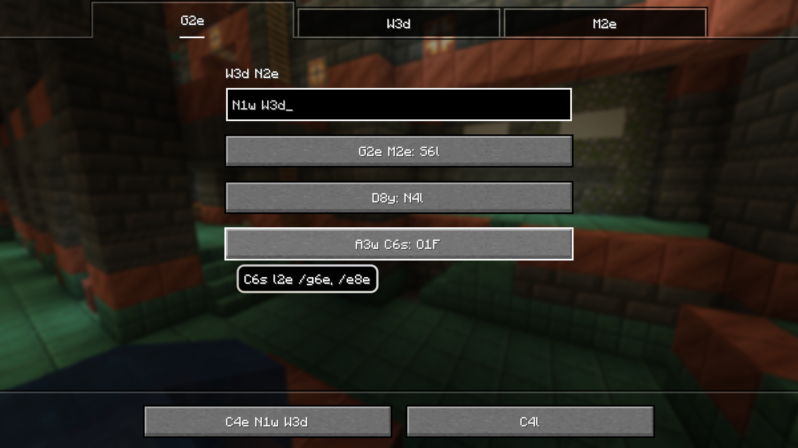
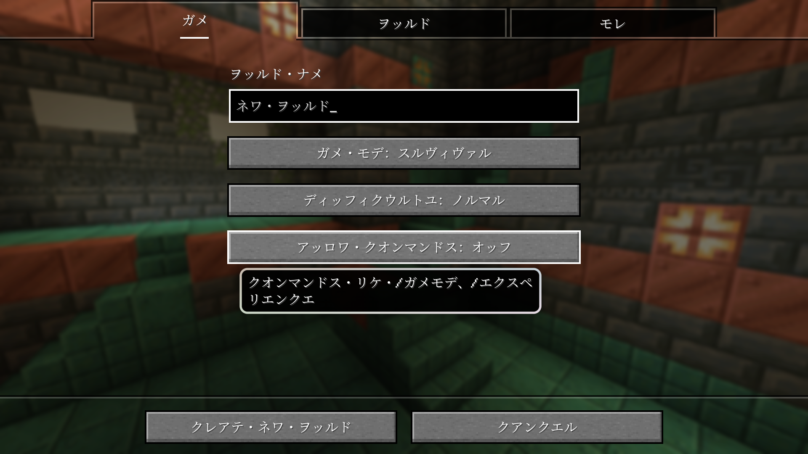
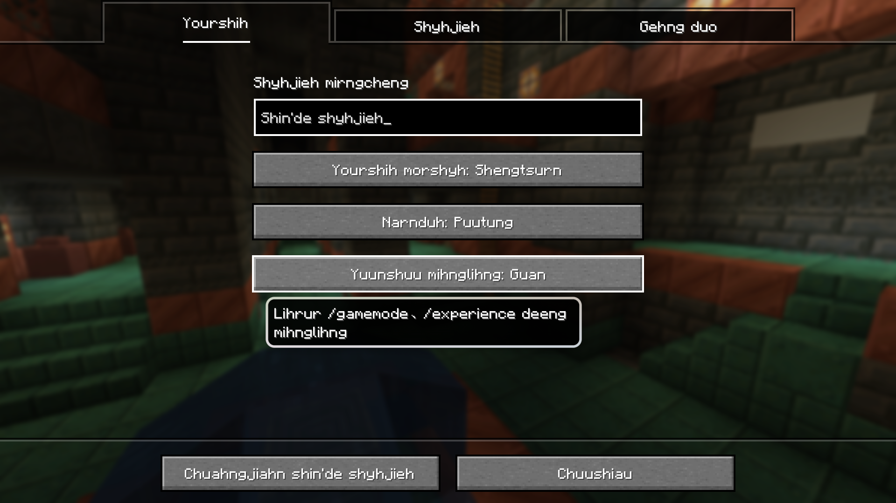
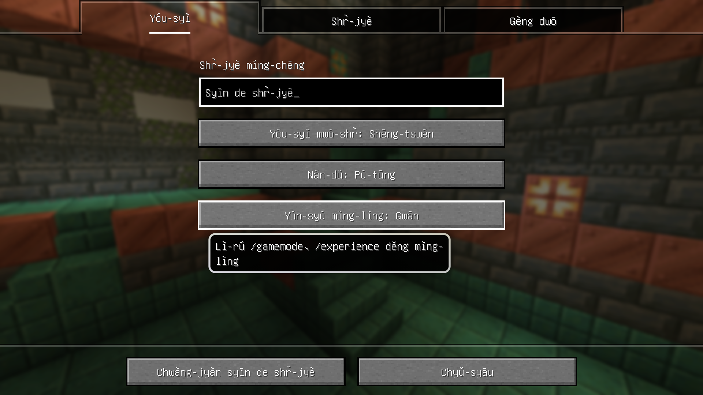
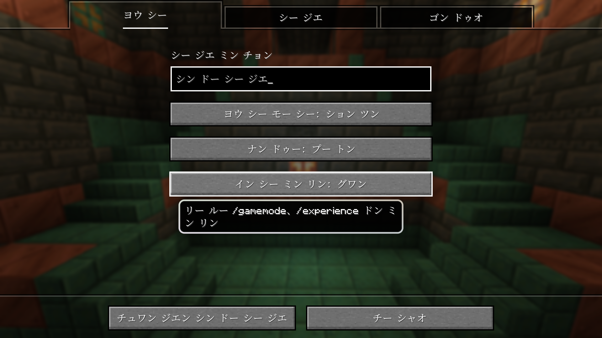
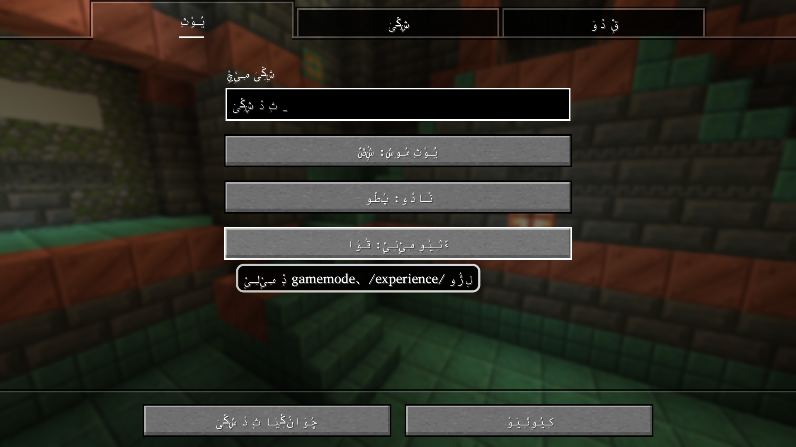

# Minecraft Unreadable Language Resource Pack

[](https://github.com/SkyEye-FAST/unreadable_language_pack/actions/workflows/update.yml) [](https://github.com/SkyEye-FAST/unreadable_language_pack/actions/workflows/pylint.yml)

- **[English](README_en.md) | [中文](README.md)**

----

This project provides a Minecraft: Java Edition resource pack which contains new non-standard "languages" converted from existing languages. See the section [#Resource Pack](#resource-pack) for more information.

Please use the mod [Modern UI](https://modrinth.com/mod/modern-ui) to make the game support modern font features to ensure that all characters are displayed normally.

It is recommended to use this resource pack with the mods [Language Reload](https://modrinth.com/mod/language-reload) and [Untranslated Items](https://www.curseforge.com/minecraft/mc-mods/untranslated-items).

## Download

- [**Download the latest version**](https://github.com/SkyEye-FAST/unreadable_language_pack/releases/latest/download/unreadable_language_pack.zip)
- [View previous versions](https://github.com/SkyEye-FAST/unreadable_language_pack/releases/)

> [!TIP]
> Since all versions of language files after 1.19.2 can be used universally, you do not necessarily need to select the tag of the corresponding version, just select the latest version.

## Description

## Dependencies

Install dependencies using the following command:

``` shell
pip install -r requirements.txt
```

### Obtaining Language Files

This repository automatically checks for updates to Minecraft: Java Edition language file (`en_us.json`, `zh_cn.json`) every day at 🕧00:30 (UTC+8, equivalent to 🕟UTC 16:30) and updates the resource pack accordingly.

### Resource Pack

The resource pack is generated using [`pack.py`](pack.py). The language files generated by the script are stored in the `output` folder, which are packed together with [`pack.mcmeta`](pack.mcmeta) and [`pack.png`](pack.png) into `unreadable_language_pack.zip`.

The resource pack added 16 languages into the game.

> [!TIP]
> The Chinese transcription comparison table used in this project is shown in the following two tables:
>
> [`comparison_table_1.tsv`](table/comparison_table_1.tsv) (with tones, phonetic notation scheme)
>
> [`comparison_table_2.tsv`](table/comparison_table_2.tsv) (without tones, foreign language transcription)
>
> The table may contain syllables that do not exist in Putonghua, such as lüan, etc., for reference only.
>
> The table omits the transliterations of ㆭ (ng, /ŋ̍/), ㆬ (m, /m̩/), ㄯ (n, /n̩/), ㄏㆬ (hm, /xm̩/), and ㄏㆭ (hng, /xŋ̍/). Most schemes do not specify how they should be spelled, and these syllables are not actually used in this project.

#### "i18nglish (i7h)" ([`en_i7h.json`](output/en_i7h.json))

- Once selected, all strings will be changed to abbreviations with the first and last characters of the English word retained and the number of characters in the middle replaced. Words with a length of 2 or less will remain unchanged.

#### "エングリスホ (カタカナ)"  ([`ja_kk.json`](output/ja_kk.json))

- i.e. "English (Katakana)".
- Once selected, all strings will be changed to Katakana transliterated from English.

> [!WARNING]
> English transliteration to katakana uses the mapping of [KotRikD/romajitable](https://github.com/KotRikD/romajitable). This is not a correct translation method and **may be very different from the real pronunciation in English**. **Please do not use the transliteration results outside of entertainment scenarios.**
>
> Transliterations of "Lena Raine" and "Samuel Åberg" will be fixed and "C418" will be retained in the results.

#### "江尓具利須保 (万葉仮名)"  ([`ja_my.json`](output/ja_my.json))

- i.e. "English (Man'yōgana)".
- Once selected, all character strings will be converted into Man'yōganas transliterated from English. In order to ensure that the generated results do not deviate too much, only one of the many possibilities of Man'yōganas is selected.

#### "繁體中文 (中國大陸)"  ([`zh_hm.json`](output/zh_hm.json))

- i.e. "Traditional Chinese (Chinese mainland)".
- Once selected, all strings will be converted from Simplified Chinese to Traditional Chinese according to GB/Z 40637-2021 and *List of Commonly Used Standard Chinese Characters* (《通用规范汉字表》).

> [!NOTE]
> The conversion between Simplified and Traditional Chinese uses the library `opencc` and the "Harmonic Mainland Traditional Chinese Standard" (調和大陸繁體標準) of [forFudan/GujiCC](https://github.com/forFudan/GujiCC).
>
> The correspondence between Chinese characters is basically from GB/Z 40637-2021, and a small part is covered by the correspondence in *List of Commonly Used Standard Chinese Characters*.

#### "Hànyǔ Pīnyīn (Zhōngguó Dàlù)"  ([`zh_py.json`](output/zh_py.json))

- i.e. "Pinyin (Chinese mainland)".
- Once selected, all strings will be changed to Pinyin transliterated from Simp. Chinese, in units of words.
  - Tried to follow the orthographic requirements of GB/T 16159-2012.

> [!IMPORTANT]
> The transliteration of Chinese uses the libraries `pypinyin` and `pypinyin_dict`, supplements the data of [cc_cedict.org](https://cc-cedict.org/), and manually adds the pronunciation of some words. In principle, the pronunciation is based on the Putonghua phonetic system. Other phonetic transcription schemes are based on this data.
>
> The word segmentation of Chinese uses the library `jieba`, with configurations of the dictionaries and corrections.
>
> Although processed, the results are still not guaranteed to fully comply with the requirements of GB/T 16159-2012. Where dashes should be added, there is no suitable method to meet the requirements.
>
> Tone sandhi (such as "一" and "不") won't be marked according to the requirements of GB/T 16159-2012.
>
> **Due to the lack of complete manual review, the word segmentation accuracy of long texts cannot be guaranteed.**

#### "Chinese in IPA (t͡ʂʊŋ˥ kwo˧˥ ta˥˩ lu˥˩)"  ([`zh_ipa.json`](output/zh_ipa.json))

- i.e. “Chinese in IPA (Chinese mainland)”.
- Once selected, all strings will be changed to IPA transliterated from Simp. Chinese.

> [!NOTE]
> The IPA transliteration scheme comes from the article [新老派普通话的宽严式记音（含儿化韵）](https://zhuanlan.zhihu.com/p/38258415) written by [@UntPhesoca](https://www.zhihu.com/people/UntW). Neutral tones won't be marked.

#### "ㄓㄨˋ ㄧㄣ ㄈㄨˊ ㄏㄠˋ (ㄓㄨㄥ ㄍㄨㄛˊ ㄉㄚˋ ㄌㄨˋ)"  ([`zh_bpmf.json`](output/zh_bpmf.json))

- i.e. "Bopomofo (Chinese mainland)”.
- Once selected, all strings will be changed to Bopomofo transliterated from Simp. Chinese.

#### "Wade–Giles (Chung¹-Kuo² Ta⁴-Lu⁴)"  ([`zh_wg.json`](output/zh_wg.json))

- i.e. "Wade–Giles (Chinese mainland)”.
- Once selected, all strings will be changed to Wade–Giles transliterated from Simp. Chinese.

#### "Gwoyeu Romatzyh (Jonggwo Dahluh)"  ([`zh_gr.json`](output/zh_gr.json))

- i.e. "Gwoyeu Romatzyh (Chinese mainland)”.
- Once selected, all strings will be changed to Gwoyeu Romatzyh transliterated from Simp. Chinese.

#### "Jiaanhuah Guoryuu Romatzyh (JJungguor Dahluh)" ([`zh_sgr.json`](output/zh_sgr.json))

- i.e. "Simplified Guoryuu Romatzyh (Chinese mainland)”.
- Once selected, all strings will be changed to Simp. Guoryuu Romatzyh transliterated from Simp. Chinese.

#### "Jù-yīn Fú-hàu Dì-èr Shr̀ (Jūng-guó Dà-lù)" ([`zh_mps2.json`](output/zh_mps2.json))

- i.e. "Mandarin Phonetic Symbols II (Chinese mainland)”.
- Once selected, all strings will be changed to Mandarin Phonetic Symbols II transliterated from Simp. Chinese.

#### "Tongyong Pinyin (Jhong-guó Dà-lù)" ([`zh_ty.json`](output/zh_ty.json))

- i.e. "Gwoyeu Romatzyh (Chinese mainland)”.
- Once selected, all strings will be changed to Tongyong Pinyin transliterated from Simp. Chinese.

#### "Yale romanization (Jūng-gwó Dà-lù)" ([`zh_yale.json`](output/zh_yale.json))

- i.e. "Yale romanization (Chinese mainland)”.
- Once selected, all strings will be changed to Yale romanization transliterated from Simp. Chinese.

#### "カタカナ (ジョン グオ ダー ルー)" ([`zh_kk.json`](output/zh_kk.json))

- i.e. "Katakana (Chinese mainland)”.
- Once selected, all strings will be changed to Katakana transliterated from Simp. Chinese.

#### "Палладицу (Чжунго далу)"  ([`zh_cy.json`](output/zh_cy.json))

- i.e. "Palladitsa (Chinese mainland)”.
- Once selected, all strings will be changed to the Cyrillic script transliterated from Simp. Chinese, according to the Palladius system.

#### "ثِیَوْعَرݣ‌ٍْ (جْو‌قُوَ دَا‌لُ)" ([`zh_xj.json`](output/zh_xj.json))

- i.e. "Xiao'erjing (Chinese mainland)”.
- Once selected, all strings will be changed to Xiao'erjing transliterated from Simp. Chinese.













## License

The resource pack is released under the [Apache 2.0 license](LICENSE).

``` text
  Copyright 2024-2025 SkyEye_FAST

  Licensed under the Apache License, Version 2.0 (the "License");
  you may not use this file except in compliance with the License.
  You may obtain a copy of the License at

      http://www.apache.org/licenses/LICENSE-2.0

  Unless required by applicable law or agreed to in writing, software
  distributed under the License is distributed on an "AS IS" BASIS,
  WITHOUT WARRANTIES OR CONDITIONS OF ANY KIND, either express or implied.
  See the License for the specific language governing permissions and
  limitations under the License.
```

## Feedback

Please feel free to raise issues for any problems encountered or feature suggestions.

Pull requests are welcome.
